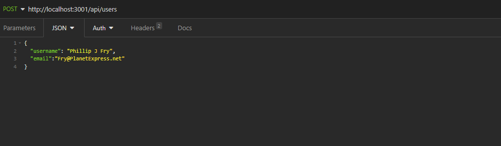
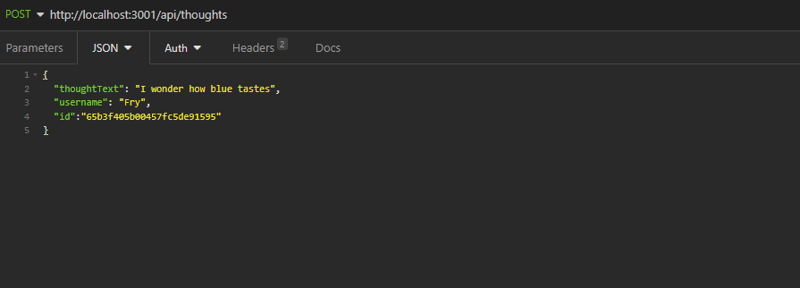
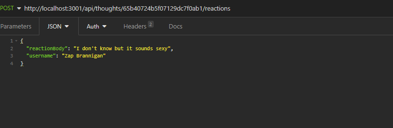

# NoSQL-No-Problem

## Description

The NoSQL-No-Problem social network api is a backend where users can create a profile, create thoughts, add friends and react to other thoughts

## Table of Contents (Optional)

If your README is long, add a table of contents to make it easy for users to find what they need.

- [Installation](#installation)
- [Usage](#usage)
- [Links](#links)

## Installation

To install you will need to open an integrated terminal in the main directory and run npm install. This will add the required node packages needed to run the program

## Usage

We will use insomnia to create the requests

the main route is the /api route
there are two main branches the /api/users route and the /api/thoughts route

you can GET all users with the /api/users route
you can GET one user using the user id with the /api/users/$ID route
it is also possible to update and delete a user using the single user route and the PUT and DEL respectively 
From the main user route and the POST command, you can also create a user given the username and email parameters

In the /api/thoughts route you can use GET to find all thoughts
using GET /api/thoughts/$ID you can find a single thought
using PUT and DEL you can update and delete thoughts
to create a thought you use POST and the main /api/thoughts with the parameters thoughtText, username id, this being the user id.

you can also add friends with the /api/users/$ID1/friends/$ID2 with ID1 being the user that will be adding the friend and ID2 being the friend to be added. using this same method and the DEL parameter you can delete a friend from a users list.

creating a reaction is similar to the friends command except the end route is /api/thoughts/$ID/reactions with ID being the thought id and the body of the POST must contain the parameters of reactionBody and username of the user creating the reaction. this route can also be used to delete a reaction. 

## Links

github repository: https://github.com/Jgarnaat/NoSQL-No-Problem

video walkthrough: https://drive.google.com/file/d/1E1tXwu14zU3WJLW12gUYiihSCy45smE3/view
